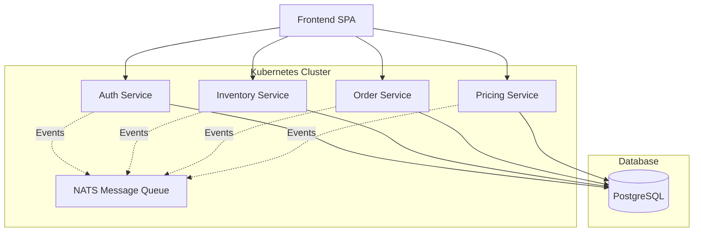
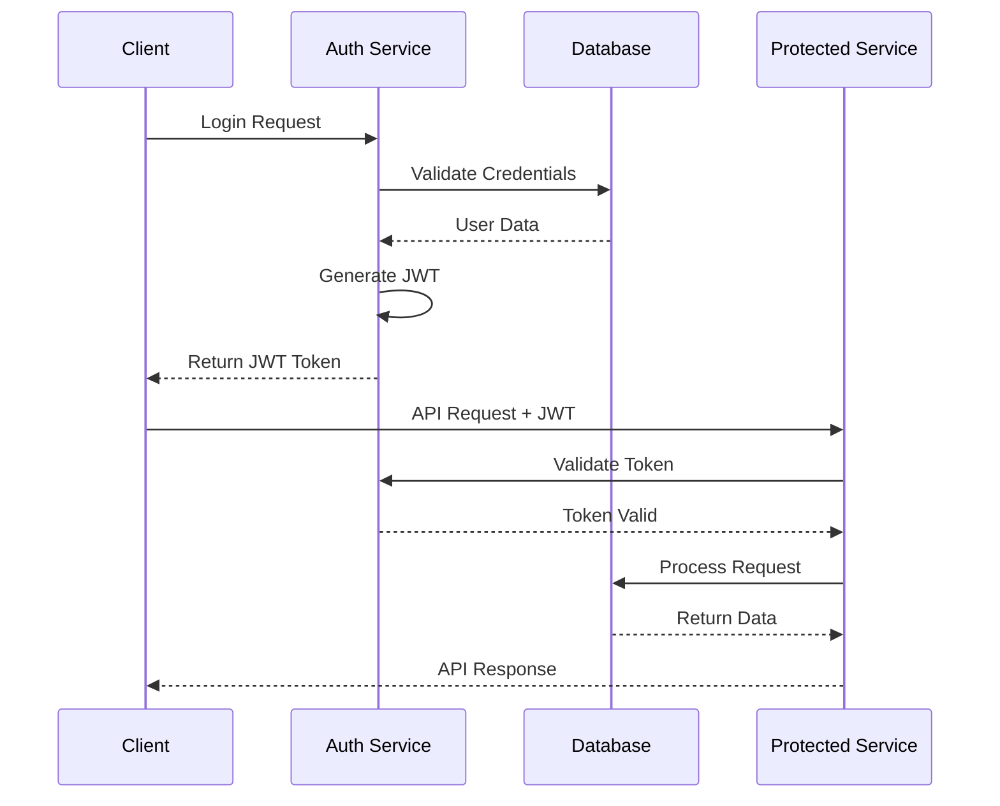
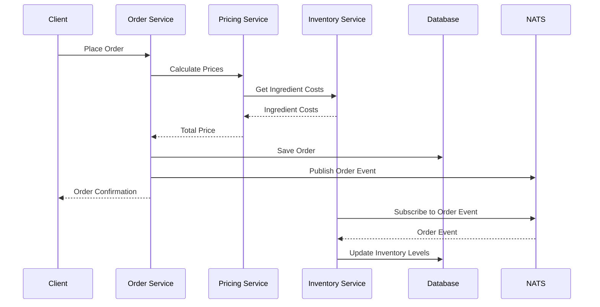
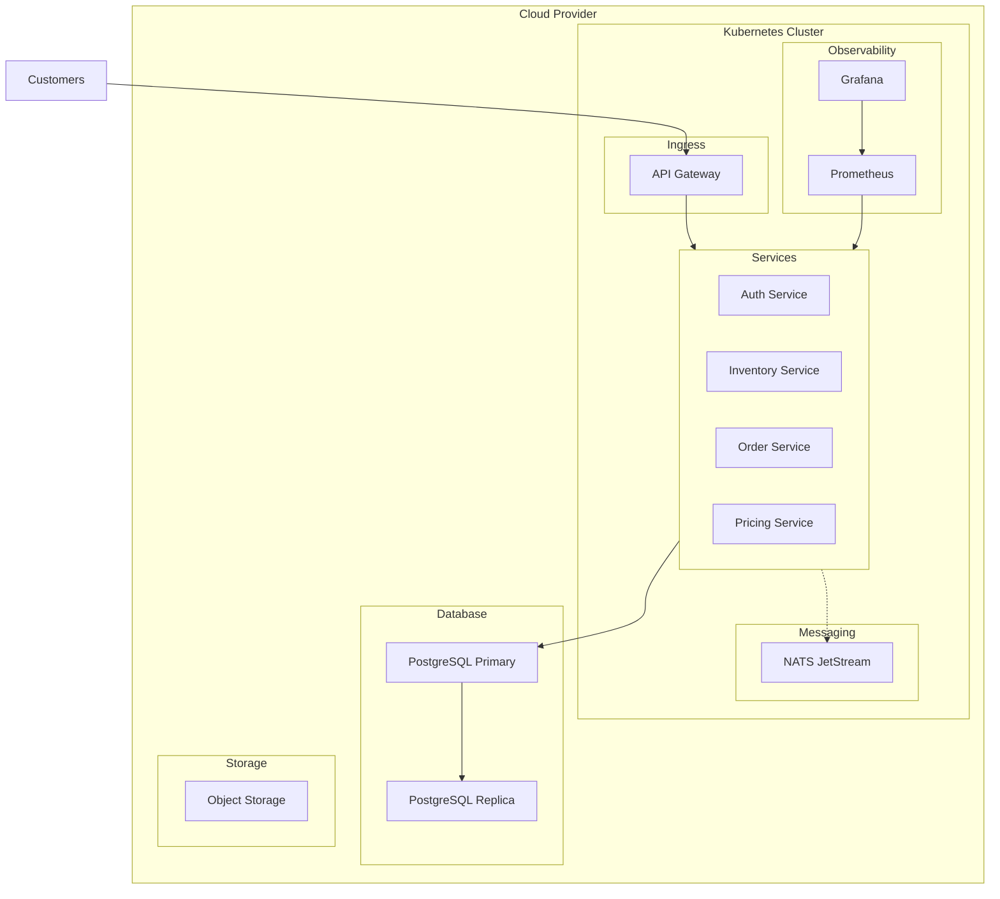
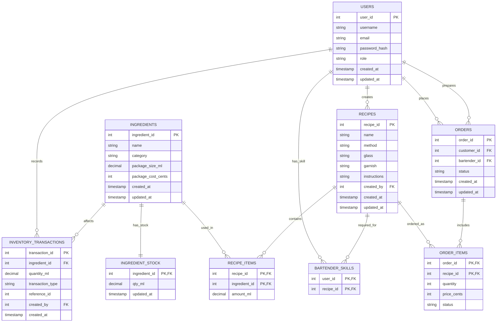
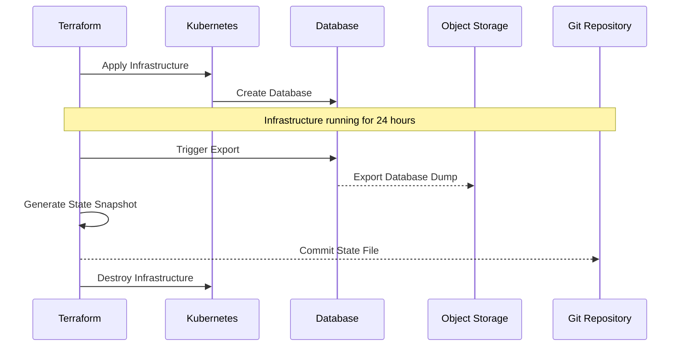

# Bartender App Architecture

This document outlines the architecture of the Bartender App, a microservices-based application for managing bar operations.

## System Architecture

The Bartender App is built using a microservices architecture with the following components:

## Service Descriptions

1. **Auth Service**: Handles user authentication, authorization, and user management. Provides JWT tokens for secure API access.

2. **Inventory Service**: Manages ingredients, recipes, and stock levels. Tracks inventory movements and alerts for low stock.

3. **Order Service**: Processes customer orders, tracks order status, and manages the order lifecycle.

4. **Pricing Service**: Calculates cocktail costs and prices based on ingredient costs and pour-cost margins.

## Sequence Diagrams

### Authentication Flow

### Order Processing Flow

## Deployment Architecture

The application is deployed on Kubernetes with the following infrastructure:

## Data Model

The core data model is represented in the following entity-relationship diagram:

## Auto-Teardown Mechanism

The infrastructure is designed to automatically tear down after 24 hours of operation. The process works as follows:

## Security Architecture

The application implements multiple security layers:

1. **Authentication**: JWT-based authentication with refresh tokens
2. **Authorization**: Role-based access control (RBAC)
3. **API Security**: TLS everywhere, rate limiting, input validation
4. **Data Security**: Encrypted database connections, password hashing
5. **Infrastructure Security**: Network policies, secrets management

## Conclusion

This architecture provides a scalable, maintainable, and secure foundation for the Bartender App. The microservices design allows for independent scaling and development of each component, while the infrastructure automation ensures efficient resource usage. 